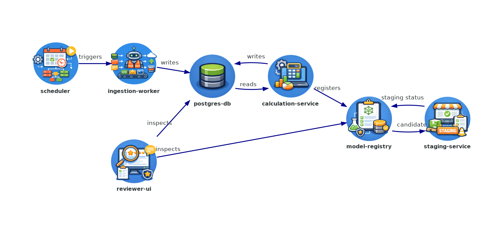

## GrazeOps Pipeline

GrazeOps Pipeline is a production-style implementation of the Part 1 grazing intelligence assignment. The system takes a ranch boundary, a time window, and herd configuration, gathers the supporting pasture, soil, and weather data for that context, and produces a recommendation for when the herd should move.

The main purpose of the repo is not to show a sophisticated model. It is to show how this kind of calculation can be turned into something operational: schedulable, reproducible, versioned, monitored, and explainable. The patterns here are meant to represent how a Data Science workflow can be packaged into services, run on a schedule, exposed through an API, and audited later when someone asks why a recommendation was made.

The repository is organized as a collection of dockerized services. The current architecture is shown below, and grading alignment notes are tracked in `docs/rubric.md`.



### Service Responsibilities

- `postgres-db` starts PostgreSQL and loads the base schema before other services start. This keeps setup simple and consistent.
- `ingestion-worker` loads source data for a boundary and date range, writes the prepared data to the DB, and records run status. It also records data checks and weather backfill when gaps exist.
- `scheduler` runs ingestion on a timer and provides `GET /ops/status`. It tells you if runs are failing, stale, or stuck.
- `calculation-service` is the API that runs recommendations and stores results. It also exposes endpoints to fetch the latest result and to explain how a result was produced.
- `model-registry` stores model versions and related metadata. It keeps history so you can see what was registered and when.
- `staging-service` takes a model from the registry, runs smoke checks, and writes pass/fail status back. This gives a clear test step before promotion.
- `reviewer-ui` is the Streamlit app used to carry out the runbook workflows, test services, view payloads, and inspect outputs and errors in one place.

### Service READMEs

- [`services/postgres-db/README.md`](services/postgres-db/README.md)
- [`services/ingestion-worker/README.md`](services/ingestion-worker/README.md)
- [`services/scheduler/README.md`](services/scheduler/README.md)
- [`services/calculation-service/README.md`](services/calculation-service/README.md)
- [`services/model-registry/README.md`](services/model-registry/README.md)
- [`services/staging-service/README.md`](services/staging-service/README.md)
- [`services/reviewer-ui/README.md`](services/reviewer-ui/README.md)
- [`services/sqlite-db/README.md`](services/sqlite-db/README.md)
- [`services/test-runner/README.md`](services/test-runner/README.md)

## Requirements and Install

For normal usage of this project, install Docker and Docker Compose (v2 plugin). The stack is containerized, so `docker compose up --build` and the recommended ephemeral smoke flow both depend on Docker/Compose.

Host Python is only needed for local host-run scripts. If you run `python3 scripts/smoke_stack.py` directly on your machine, you need Python 3 installed, but no extra libraries for that script (it uses only the standard library).

Unit tests are currently host-run and are not Dockerized in the main service containers. The service images stay runtime-focused and do not include `pytest` or other dev dependencies. If you want to run unit tests, install dev dependencies on host first:

```bash
python3 -m pip install -r requirements-dev.txt
```

If you prefer Dockerized unit tests, use the dedicated test container:

```bash
docker compose --profile test run --rm test-runner
```

## Ingestion (Schedulable + Backfill via Date Ranges)

Ingestion runs through `ingestion-worker` and always stays tied to a boundary context and explicit date range. That keeps normal daily runs and historical backfills on the same execution path instead of maintaining separate tooling. A run accepts a boundary identifier (or boundary GeoJSON) along with start and end dates, and can optionally enable weather backfill when there are missing days inside the selected window.

The implementation uses the provided reference source database (`inputs/pasture_reference.db`) as the default source and can optionally pull live weather from OpenMeteo (`PREFER_OPENMETEO=1`) with fallback to reference weather data. We explicitly handle CRS alignment and daily temporal alignment of RAP/weather records, and any missing or misaligned days are written as data-quality checks.

Scheduling is intentionally handled outside ingestion logic. The `scheduler` service triggers ingestion at a fixed cadence using `SCHEDULE_INTERVAL_SECONDS`, so timing control stays centralized and ingestion code remains focused on data preparation. Each run writes status, timing, and error details to run metadata tables, which gives a clear run history without depending on manual log digging.

## Deployment (API)

Recommendation logic is deployed as `calculation-service`, an HTTP API rather than a local-only script. That makes the same interface available to UI-driven testing, scripted checks, and service-to-service calls.

Operationally, the API keeps a compact shape: `GET /health` for liveness, `POST /calculate` for execution, `GET /recommendations/latest` for current output, and `GET /recommendations/explain` for traceability. Calculation requests persist both recommendation output and run metadata so execution history remains intact.

## DQ/Monitoring (What Checks Exist + Where)

Data quality checks run during ingestion and are stored in the database. The checks target practical reliability concerns: whether expected source data exists in the requested period, whether herd configuration is usable, whether RAP is stale, whether RAP and weather align by day, and whether weather backfill was needed.

Monitoring is intentionally lightweight and focused on actionable status. The scheduler exposes `GET /ops/status`, which summarizes recent failure patterns, stale scheduler activity, and runs that look stuck in progress. This status is also surfaced in reviewer workflows so operational checks happen alongside day-to-day testing instead of in a separate tool.

Alert thresholds and escalation are explicit:

- Stale scheduler activity threshold: `OPS_MAX_TRIGGER_IDLE_SECONDS` (default `max(3 * interval, 900s)`).
- Failed-run threshold: `OPS_MAX_FAILED_RUNS_24H` (default `0`).
- Stuck-run threshold: `OPS_STUCK_RUN_MINUTES` (default `30`).
- If `/ops/status` returns degraded once, open an operations ticket and investigate ingestion run metadata + DQ checks.
- If degraded persists for two scheduler intervals, or if any stuck-run violation appears, page on-call immediately.
- If the issue is source-data freshness/completeness, escalate to DS to confirm threshold overrides vs. data-source outage handling.

## Versioning/Audit (How to Reproduce / Explain)

The pipeline stores run IDs, snapshot IDs, version fields, and timestamps so past recommendations can be reconstructed with context. Ingestion contributes snapshot and run history; calculation contributes recommendation runs and version metadata; together they provide a coherent lineage path.

`GET /recommendations/explain` is the primary audit view. It ties recommendation output back to the source snapshot and run records that produced it, which is the expected answer path for review and grading questions about why a recommendation exists.

## Ownership Boundary

Data Science owns the model logic and parameter choices.

ML Ops owns the system that runs that logic in production: ingestion, scheduling, deployment, monitoring, and run history.

DS ships versioned model/config updates. ML Ops deploys those updates, checks operational health, and rolls back if the update causes failures or degraded monitoring status.

## Viz + CI/CD (Design)

Visualization is handled in the Streamlit app (`services/reviewer-ui/pages/2_Grazing_Visualization.py`) and is used as the rancher-facing mock for this assignment.

For this assignment, the CI/CD flow is intentionally simple:

1. CI validation: run unit tests, run smoke checks, and verify service health endpoints.
2. Release decision: if checks pass, deploy the new version and mark it as staged/promoted in the registry; if checks fail, stop.
3. Recovery path: if the release causes failures, revert to the last known good version and investigate before retrying.

For a real production setup, the same pattern should run with stronger controls:

1. Build and publish: create an immutable image, run dependency/security scans, and publish a versioned artifact.
2. Staging verification: deploy to staging first, run automated integration checks, and compare key metrics to baseline.
3. Progressive rollout: release to production in controlled phases (for example, canary) while watching service and business health.
4. Fast rollback: keep the prior stable version ready so rollback is immediate if errors rise or health degrades.

## Running the System

All assignment inputs are vendored under `./inputs`, so this repository runs without depending on an external sibling repo.

From the repository root, start the stack with:

```bash
docker compose up --build
```

Once services are up, the main entry points are the reviewer UI at `http://localhost:8501`, model registry at `http://localhost:8088`, calculation API at `http://localhost:8089`, and scheduler ops status at `http://localhost:8090/ops/status`.

The Streamlit reviewer UI is not just a demo surface. It is the primary reviewer-facing interface for the operational procedures in `docs/runbook.md`: model update validation, data-quality investigation, and historical recommendation reproduction. The shell commands in the runbook are kept as direct backend equivalents.

## Smoke Tests

For this assignment, the recommended smoke path is the isolated ephemeral flow:

```bash
./scripts/smoke_ephemeral.sh
```

This creates a temporary Compose project with its own Postgres volume/network, seeds ingestion once, runs smoke, and tears everything down automatically.

If you already have the stack running and only want a quick check, use:

```bash
python3 scripts/smoke_stack.py
```

If your environment uses different boundary IDs, provide boundary candidates as an override:

```bash
BOUNDARY_CANDIDATES="boundary_north_paddock_3" python3 scripts/smoke_stack.py
```

You can tune timing behavior with `SMOKE_MAX_WAIT_SECONDS` and `SMOKE_RETRY_SECONDS`, and optionally enable replay stability checks with `SMOKE_ENABLE_REPLAY_CHECK=1`.

## Unit Tests

Unit tests cover ingestion helpers, calculation behavior, and scheduler ops evaluation logic.

Run them from repo root with:

```bash
python3 -m pytest -q
```

Dockerized equivalent:

```bash
docker compose --profile test run --rm test-runner
```

## Design Choices, Real World Deviations

I made a few deliberate design choices in this project. The goal was not to build a perfect production platform in miniature. The goal was to show the patterns I would use to take research-style logic and turn it into something that is more reliable, reproducible, and operationally usable.

In some places, that meant adding a little more structure because it solves a real problem. Smoke tests run in their own temporary stack instead of against the long-running services. That keeps test runs isolated, prevents them from polluting shared state, and makes the results easier to trust. I also moved from SQLite to PostgreSQL once it became clear that ingestion activity and test activity could overlap. SQLite is fine for simple local workflows, but once multiple processes may read and write at the same time, PostgreSQL is the safer choice.

In other places, I intentionally kept the design simple. The scheduler is just a small service that runs ingestion on a fixed interval. For this project, that is enough. The ingestion engine does not need a heavy orchestration layer to prove the design. In a real environment, the same ingestion engine could just as easily be triggered by Airflow, Prefect, Dagster, or a cloud scheduler. The important design choice is not the specific tool. It is keeping scheduling separate from ingestion so timing and execution logic do not get tangled together.

I also included a lightweight model registry service. The point here is not to claim that I would build a full registry from scratch in production. The point is to make version history, staging status, and deployment flow explicit in a way that is easy to review. In a real system, I would usually lean on something like MLflow or a managed registry. For this assignment, though, the smaller service makes the ownership boundary and release path much easier to show clearly.

If this system grew, the registry would likely expand beyond simple version tracking. It would also track training runs, parameters, metrics, configuration snapshots, and pointers to artifacts stored elsewhere. I did not build all of that here because the recommendation logic is simple and the assignment is more about deployment pattern, reproducibility, and operational design than about model management at full scale.

I would also treat storage differently over a longer time horizon. The live database only needs the recent operational data, current configurations, recent recommendations, and enough metadata to explain or reproduce a run quickly. Older raw inputs and snapshots that mainly matter for audit can be moved into cheaper object storage. The database can then keep the IDs, hashes, timestamps, and storage locations needed to retrieve that older evidence later without forcing the operational system to carry everything forever.

I also did not add full drift or anomaly monitoring for the recommendation logic in this project. I mention it because those are controls that are commonly implemented in real production ML systems, and they are often part of the broader monitoring conversation when people talk about operational maturity. In this case, though, they are not especially valid for the current calculator. The logic here is simple, rules-based, and directly interpretable, so the more meaningful monitoring is around input freshness, completeness, run health, and reproducibility. If this calculator were later replaced with a more realistic learned model, drift and anomaly monitoring would become much more appropriate to add.

## What I Would Do With More Time

The biggest improvement would be more hands-on refinement of the code itself. I used Codex to scaffold parts of the implementation, but with more time I would do a more thorough human pass on structure, naming, and simplification across the services. The current version is functional and clear enough for the assignment, but there are places where I would tighten the code further rather than relying as much on generated scaffolding.

I would also make parts of the operational flow feel more realistic. Some pieces in this project, especially around staging and model promotion, are intentionally lightweight stand-ins so the ownership boundaries and deployment pattern are visible. With more time, I would make those flows look more like a real environment, with clearer artifact handling and a more realistic path from candidate version to staged version to production release.

On the UI side, I would spend more time polishing the Streamlit experience. The current app is enough to show the rancher-facing wireframe and service testing flow, but I would improve the layout, visual consistency, and wording so it feels more finished.

Finally, I would improve the documentation structure. The content is there, but with more time I would tighten the organization further so the repo is even easier for a reviewer to navigate quickly.
